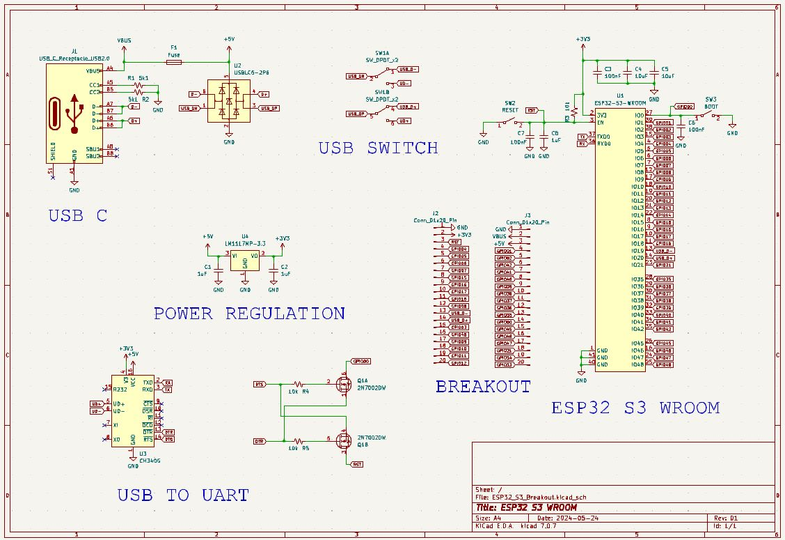
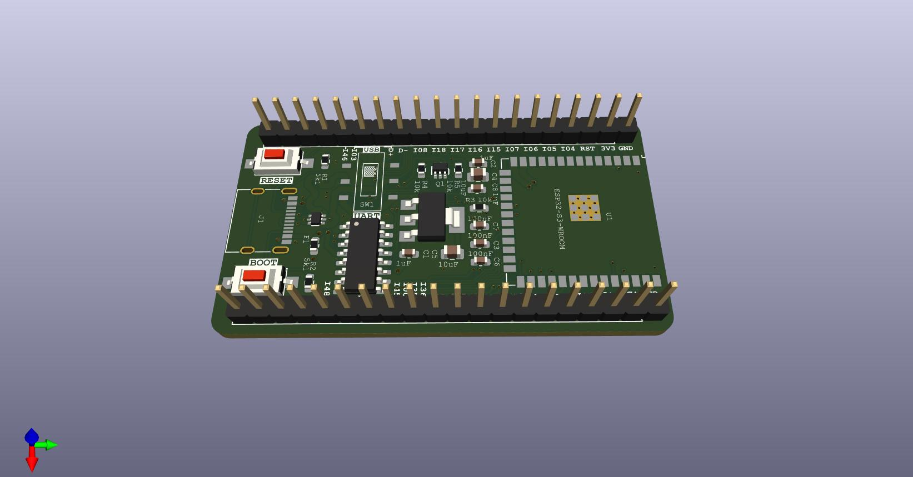

# ESP32_S3_WROOM_Breakout
Breakout Board for ESP32 S3 WROOM

This board is a simple breakout for the ESP32 S3 WROOM.  The interface includes the standard reset and boot button, with a USB to UART CH340G converter, and a 3V3 regulator.  All GPIO pins are broken out to standard 2.54mm headers.  USB-C reseptacle connector is used, but at the USB 2.0 standard. 

## Purpose
This is mostly an excersize in designing an ESP32 module for inclusion in other projects.  Once this design is functional, I'll start using it as a template for more custom oriented projects involving the chip (or some variant).  I decided on the ESP S3 WROOM, because the S2 Solo seems to be slowly phasing out, and also doesn't have bluetooth functionality.  Depending on how this excersize goes, I may start designing boards with just the bare chip (no built in WiFi antenna, SPI Flash, etc).    

## Scematic

## Layout

## 3D View

## Current State of Affairs
### Version 1
* Populate and test board
* Upload some blink/hello world sketch
* Fix the inevitable issue that I missed during production

